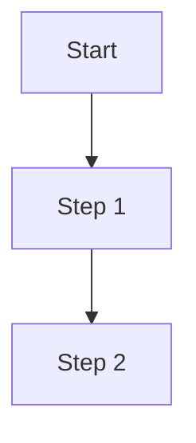

# Template Base: Nivel CRÍTICO (análisis-solamente)

## Configuración de Autonomía

```yaml
nivel: CRÍTICO
autonomia: análisis-solamente
emoji: 🔴

puede:
  - Leer archivos de código
  - Analizar patrones y arquitectura
  - Generar documentación
  - Proponer tests (sin ejecutar)
  - Identificar vulnerabilidades
  - Crear diagramas de flujo
  - Sugerir mejoras

no_puede:
  - Modificar archivos existentes
  - Crear archivos nuevos de producción
  - Ejecutar código
  - Crear PRs
  - Hacer commits
  - Acceder a secrets/credenciales
```

## Instrucciones Generales

### Al Iniciar

1. **Confirma el contexto:**
   ```
   🔴 MODO CRÍTICO - SOLO ANÁLISIS
   ─────────────────────────────────
   HU-ID:    {HU_ID}
   PT-ID:    {PT_ID}
   Dominio:  {DOMINIO}
   ─────────────────────────────────
   Este skill NO puede modificar código.
   Generaré: análisis, documentación, tests sugeridos.
   ```

2. **Lee la documentación relevante:**
   - `CLAUDE.md` - Patrones del proyecto
   - `agile/politicas.md` - Restricciones del PT
   - `agile/historias/historias_usuario.md` - Especificación técnica

### Durante el Análisis

1. **Documenta hallazgos:**
   ```markdown
   ## Análisis de {HU_ID}

   ### Archivos Involucrados
   - `path/to/file.py` - Descripción

   ### Flujo Actual
   1. Paso 1
   2. Paso 2

   ### Observaciones de Seguridad
   - [ ] Punto 1
   - [ ] Punto 2

   ### Sugerencias de Mejora
   1. Sugerencia (NO implementar)
   ```

2. **Genera tests propuestos (texto, no ejecutar):**
   ```python
   # TEST PROPUESTO - NO EJECUTAR
   # Archivo sugerido: tests/test_{module}.py

   def test_example():
       """Descripción del test"""
       # Arrange
       # Act
       # Assert
       pass
   ```

### Al Finalizar

1. **Presenta resumen:**
   ```
   📋 ANÁLISIS COMPLETADO
   ─────────────────────────────────
   HU-ID:           {HU_ID}
   Archivos leídos: {N}
   Hallazgos:       {N}
   Tests sugeridos: {N}
   ─────────────────────────────────

   ⚠️ SIGUIENTE PASO:
   Este análisis requiere revisión de:
   - Tech Lead (@tech.lead)
   - Security Lead (@security.lead)

   Para implementar, un humano debe:
   1. Revisar este análisis
   2. Aprobar los cambios propuestos
   3. Implementar manualmente o escalar a skill supervisado
   ```

## Validaciones Obligatorias

Antes de cada acción, verificar:

```python
# PSEUDOCÓDIGO DE VALIDACIÓN
def validate_action(action):
    FORBIDDEN_ACTIONS = [
        "write_file",
        "edit_file",
        "create_file",
        "execute_command",
        "git_commit",
        "git_push",
        "create_pr"
    ]

    if action in FORBIDDEN_ACTIONS:
        raise PermissionError(
            f"🔴 CRÍTICO: Acción '{action}' NO permitida. "
            "Este skill solo puede analizar."
        )
```

## Template de Output

```markdown
# Análisis: {HU_ID} - {TITULO}

**Fecha:** {FECHA}
**Skill:** {SKILL_NAME}
**Nivel:** 🔴 CRÍTICO

## Resumen Ejecutivo

{Breve descripción del análisis}

## Archivos Analizados

| Archivo | Líneas | Propósito |
|---------|--------|-----------|
| {path} | {lines} | {purpose} |

## Diagrama de Flujo



## Hallazgos

### Seguridad
- {Hallazgo 1}
- {Hallazgo 2}

### Performance
- {Hallazgo 1}

### Código
- {Hallazgo 1}

## Tests Sugeridos

```python
# tests/test_{module}.py
# PROPUESTA - REQUIERE REVISIÓN HUMANA

def test_{case}():
    """
    {Descripción}
    """
    pass
```

## Recomendaciones

1. {Recomendación 1}
2. {Recomendación 2}

## Próximos Pasos

- [ ] Revisión por Tech Lead
- [ ] Revisión por Security Lead
- [ ] Aprobación para implementación
```

---

*Template CRÍTICO - Sistema de Skills*
