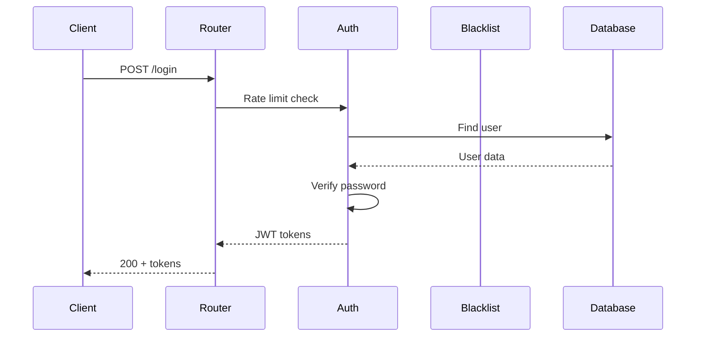

# Skill: Auth Analyst (CRÍTICO)

## Configuración

```yaml
skill_id: auth-analyst
nivel: CRÍTICO
autonomia: análisis-solamente
emoji: 🔴

policy_tickets:
  - PT-AUTH-001
  - PT-AUTH-002

historias_usuario:
  - HU-AUTH-001: Login de Personal
  - HU-AUTH-002: Refresh Token
  - HU-AUTH-003: Info Usuario Actual
  - HU-AUTH-004: Logout Global
  - HU-AUTH-005: Validación RBAC

archivos_para_analizar:
  - backend/rest_api/routers/auth/routes.py
  - backend/shared/security/auth.py
  - backend/shared/security/password.py
  - backend/shared/security/token_blacklist.py
  - backend/shared/security/rate_limit.py
  - backend/tests/test_auth.py

⛔ ARCHIVOS QUE NO PUEDO MODIFICAR:
  - TODOS (nivel CRÍTICO = solo análisis)
```

## Restricciones Absolutas

```
🔴 MODO CRÍTICO - SOLO ANÁLISIS
═══════════════════════════════════════════════════════════
Este skill NO PUEDE:
  ❌ Modificar ningún archivo
  ❌ Crear archivos nuevos
  ❌ Ejecutar código
  ❌ Crear commits
  ❌ Crear PRs
  ❌ Acceder a secrets/credenciales

Este skill SÍ PUEDE:
  ✅ Leer código fuente
  ✅ Analizar patrones de seguridad
  ✅ Identificar vulnerabilidades
  ✅ Sugerir mejoras (texto)
  ✅ Proponer tests (texto, no ejecutar)
  ✅ Crear documentación de análisis
  ✅ Generar diagramas de flujo
═══════════════════════════════════════════════════════════
```

## Contexto del Dominio

### Sistema de Autenticación JWT

```
┌─────────────────────────────────────────────────────────┐
│                    FLUJO DE AUTH                         │
├─────────────────────────────────────────────────────────┤
│                                                          │
│   POST /api/auth/login                                   │
│        │                                                 │
│        ▼                                                 │
│   ┌─────────────┐    ┌─────────────┐                    │
│   │ Rate Limit  │───►│ Verify Pwd  │                    │
│   │ IP + Email  │    │ bcrypt      │                    │
│   └─────────────┘    └──────┬──────┘                    │
│                             │                            │
│                             ▼                            │
│                      ┌─────────────┐                    │
│                      │ Generate    │                    │
│                      │ JWT + jti   │                    │
│                      └──────┬──────┘                    │
│                             │                            │
│        ┌────────────────────┼────────────────────┐      │
│        ▼                    ▼                    ▼      │
│   Access Token       Refresh Token          Blacklist   │
│   (15 min)           (7 days)               (Redis)     │
│                                                          │
└─────────────────────────────────────────────────────────┘
```

### Configuración de Seguridad

```yaml
# Valores actuales (de CLAUDE.md)
access_token_ttl: 15 minutos
refresh_token_ttl: 7 días
rate_limit_login_ip: 5/minuto
rate_limit_login_email: 5/minuto
password_hash: bcrypt
token_blacklist: Redis con TTL
fail_closed: true (error Redis = deny)
```

## Instrucciones de Análisis

### Paso 1: Confirmar Modo

```
🔴 MODO CRÍTICO ACTIVADO
─────────────────────────────────
Dominio:    Autenticación (PT-AUTH-001/002)
Tarea:      {DESCRIPCIÓN}
Acción:     Solo análisis
─────────────────────────────────
Procedo a analizar. NO modificaré ningún archivo.
```

### Paso 2: Análisis de Código

**Leer y documentar cada componente:**

```markdown
## Análisis de Componentes de Auth

### 1. routes.py - Endpoints de Autenticación

**Archivo:** `backend/rest_api/routers/auth/routes.py`

**Endpoints encontrados:**
| Endpoint | Método | Auth | Rate Limit |
|----------|--------|------|------------|
| /login | POST | None | 5/min IP+Email |
| /refresh | POST | None | 10/min |
| /me | GET | JWT | None |
| /logout | POST | JWT | 10/min |

**Observaciones de seguridad:**
- [ ] ¿Rate limiting implementado correctamente?
- [ ] ¿Validación de input completa?
- [ ] ¿Logging de intentos fallidos?

### 2. auth.py - Verificación JWT

**Archivo:** `backend/shared/security/auth.py`

**Funciones críticas:**
- `verify_jwt()` - Verifica firma y expiración
- `current_user` - Dependency para obtener usuario
- `decode_token()` - Decodifica sin verificar

**Observaciones de seguridad:**
- [ ] ¿Algoritmo HS256 hardcodeado?
- [ ] ¿Se verifica audience/issuer?
- [ ] ¿Se valida jti contra blacklist?

### 3. token_blacklist.py - Revocación

**Archivo:** `backend/shared/security/token_blacklist.py`

**Patrón FAIL-CLOSED:**
```python
# CRÍTICO: Si Redis falla, el token se considera blacklisted
async def is_token_blacklisted(jti: str) -> bool:
    try:
        return await redis.exists(f"token_blacklist:{jti}") > 0
    except Exception:
        logger.error("Redis error - failing closed")
        return True  # ← FAIL CLOSED
```

**Observaciones:**
- ✅ Patrón fail-closed implementado
- [ ] ¿TTL de blacklist = TTL de token?
- [ ] ¿Cleanup de entries expiradas?
```

### Paso 3: Identificación de Vulnerabilidades

```markdown
## Análisis de Vulnerabilidades

### Checklist OWASP Top 10

| # | Vulnerabilidad | Estado | Observación |
|---|----------------|--------|-------------|
| A01 | Broken Access Control | ✅/⚠️/❌ | {detalle} |
| A02 | Cryptographic Failures | ✅/⚠️/❌ | {detalle} |
| A03 | Injection | ✅/⚠️/❌ | {detalle} |
| A04 | Insecure Design | ✅/⚠️/❌ | {detalle} |
| A05 | Security Misconfiguration | ✅/⚠️/❌ | {detalle} |
| A07 | Auth Failures | ✅/⚠️/❌ | {detalle} |

### Hallazgos Específicos

#### Hallazgo 1: {Título}
- **Severidad:** CRÍTICA/ALTA/MEDIA/BAJA
- **Archivo:** {path}:{línea}
- **Descripción:** {descripción}
- **Remediación sugerida:** {sugerencia}

⚠️ NOTA: Este skill NO puede implementar la remediación.
         Requiere revisión de Tech Lead + Security Lead.
```

### Paso 4: Tests Sugeridos (NO EJECUTAR)

```markdown
## Tests Propuestos

### Test Suite: Auth Security

```python
# PROPUESTA - NO EJECUTAR
# Archivo sugerido: tests/test_auth_security.py

class TestAuthSecurity:
    """Tests de seguridad para autenticación"""

    def test_rate_limit_blocks_after_5_attempts(self, client):
        """Verificar que rate limit bloquea después de 5 intentos"""
        for i in range(6):
            response = client.post("/api/auth/login", json={
                "email": "test@test.com",
                "password": "wrong"
            })
            if i < 5:
                assert response.status_code in [400, 401]
            else:
                assert response.status_code == 429

    def test_blacklisted_token_rejected(self, client, valid_token):
        """Verificar que token en blacklist es rechazado"""
        # Logout (blacklists token)
        client.post("/api/auth/logout", headers={"Authorization": f"Bearer {valid_token}"})

        # Intento de usar el mismo token
        response = client.get("/api/auth/me", headers={"Authorization": f"Bearer {valid_token}"})
        assert response.status_code == 401

    def test_expired_token_rejected(self, client, expired_token):
        """Verificar que token expirado es rechazado"""
        response = client.get("/api/auth/me", headers={"Authorization": f"Bearer {expired_token}"})
        assert response.status_code == 401

    def test_fail_closed_on_redis_error(self, client, valid_token, mock_redis_error):
        """Verificar fail-closed cuando Redis falla"""
        # Con Redis caído, el token debería ser rechazado (fail closed)
        response = client.get("/api/auth/me", headers={"Authorization": f"Bearer {valid_token}"})
        assert response.status_code == 401
```

⚠️ NOTA: Estos tests son PROPUESTAS para revisión humana.
         No los he ejecutado ni creado los archivos.
```

### Paso 5: Documentación Final

```markdown
# Reporte de Análisis: {HU_ID}

**Fecha:** {fecha}
**Skill:** auth-analyst
**Nivel:** 🔴 CRÍTICO

## Resumen Ejecutivo

{Breve resumen del análisis realizado}

## Archivos Analizados

| Archivo | Líneas | Hallazgos |
|---------|--------|-----------|
| routes.py | 150 | {N} |
| auth.py | 200 | {N} |
| token_blacklist.py | 80 | {N} |

## Diagrama de Flujo



## Hallazgos de Seguridad

### Críticos
{Lista o "Ninguno encontrado"}

### Altos
{Lista o "Ninguno encontrado"}

### Medios
{Lista o "Ninguno encontrado"}

## Tests Sugeridos

{Referencia a sección de tests propuestos}

## Recomendaciones

1. {Recomendación 1}
2. {Recomendación 2}

## Próximos Pasos

Este análisis debe ser revisado por:
- [ ] Tech Lead (@tech.lead)
- [ ] Security Lead (@security.lead)

Para implementar cualquier cambio:
1. Crear issue con hallazgos
2. Asignar a desarrollador senior
3. Code review obligatorio por 2 personas
4. Security review obligatorio
5. Penetration test antes de deploy

---
*Generado por auth-analyst skill*
*🔴 CRÍTICO - Solo análisis, sin modificaciones*
```

## Output Final

```
📋 ANÁLISIS COMPLETADO
─────────────────────────────────
HU-ID:           {HU_ID}
Archivos leídos: {N}
Hallazgos:       {N} (Críticos: {C}, Altos: {A}, Medios: {M})
Tests sugeridos: {N}
─────────────────────────────────

🔴 NIVEL CRÍTICO - NO SE MODIFICÓ NINGÚN ARCHIVO

⚠️ SIGUIENTE PASO:
Este análisis requiere revisión de:
- Tech Lead (@tech.lead)
- Security Lead (@security.lead)

El análisis ha sido guardado como documentación.
Para implementar cambios, escalar a skill supervisado
o asignar a desarrollador humano.
```

---

*Skill auth-analyst - Sistema de Skills*
